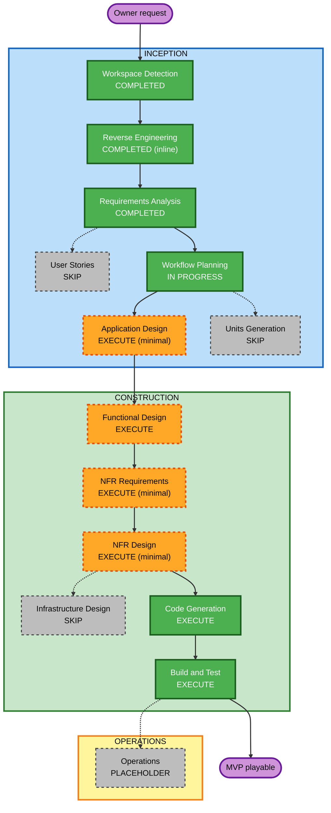

# Execution Plan — `hspip-lab`

**Date**: 2026-08-19 · **Unit**: `hspip-lab` · **Type**: New feature, standalone-first

---

## Detailed Analysis Summary

### Transformation Scope (brownfield)
- **Type**: Single new, **isolated** component — a standalone WebGL app. **Not** an architectural change to any existing system.
- **Primary change**: net-new `hspip-lab/` app at repo root.
- **Related components**: **none modified.** It reads a read-only JSON snapshot built from `curation/hsp-*.csv`. It does **not** touch `web/` (Astro site), root `src/` (legacy "react-example" SPA), the DB, or the API.

### Change Impact Assessment
- **User-facing**: Yes — a new interactive tool (but isolated; nothing else changes).
- **Structural**: No — no change to existing architecture.
- **Data model**: No — reuses existing HSP data as read-only bundled JSON (CSV == DB, verified).
- **API**: No.
- **NFR impact**: Yes — real-time WebGL performance + testability of the Hansen math.

### Component Relationships
- **Primary**: `hspip-lab/` (new, standalone).
- **Shared (read-only)**: `curation/hsp-solvents.csv`, `curation/hsp-polymers.csv` → bundled to JSON at build.
- **Reuse (copy/adapt, not import)**: the proven Hansen metric from `web/src/lib/learn/hansen-space.ts` (Ra with 2·δD weighting, RED, plot-space transform) — re-implemented in a framework-agnostic core so the later Learn island and this tool share one metric.
- **Dependent components**: none. **Supporting**: Vite dev server + a `.claude/launch.json` entry for preview.

### Risk Assessment
- **Risk Level**: **Low–Medium.** Isolated; trivial rollback (delete one folder).
- **Rollback complexity**: Easy.
- **Testing complexity**: Moderate (pure math → property-tested; 3D interaction → manual/browser-verified).
- **Real technical risks (both well-understood):**
  1. **Translucent overlap** — multiple see-through spheres/points must show through one another correctly. Mitigation: WebGL depth buffer + per-material `transparent/opacity`, `depthWrite:false` on spheres, back-to-front sort; this is exactly what SVG could not do and three.js does natively.
  2. **Point count** — only *added* solvents render (seed 5 + a handful), never all 1180 at once; even 1180 as an instanced cloud is trivial for three.js. Search operates on the in-memory list, not the scene.

---

## Workflow Visualization

---

## Phases to Execute

### 🔵 INCEPTION
- [x] Workspace Detection — COMPLETED
- [x] Reverse Engineering — COMPLETED (inline; current tool understood)
- [x] Requirements Analysis — COMPLETED & APPROVED
- [x] User Stories — **SKIP** · *Single persona (owner/researcher); requirements concrete.*
- [~] Workflow Planning — IN PROGRESS
- [ ] Application Design — **EXECUTE (minimal)** · *Net-new app; define the internal module split and the framework-agnostic math/data core (NFR-6 portability). Not a service architecture, so kept light.*
- [ ] Units Generation — **SKIP** · *One cohesive unit; no multi-package decomposition.*

### 🟢 CONSTRUCTION
- [ ] Functional Design — **EXECUTE** · *Real domain logic to pin down: Ra/RED, the auto-grade band thresholds + manual-override model, seed-solvent selection (water + 4 nearest), custom-polymer validation, the interaction/state model. Includes a "Testable Properties" section for PBT.*
- [ ] NFR Requirements — **EXECUTE (minimal)** · *Perf targets (fps), tech-stack lock (three.js, React shell, Vite, TS), and the one PBT-driven decision: add `vitest` + `fast-check` as dev-deps (PBT-09). Security-applicable rules (05/09/10/15).*
- [ ] NFR Design — **EXECUTE (minimal)** · *How those are realized: transparency/depth handling, input-validation module for custom polymer, top-level error boundary, instanced rendering if the cloud grows.*
- [ ] Infrastructure Design — **SKIP** · *No cloud/infra. "Deployment" = a local Vite dev server + a `.claude/launch.json` entry; captured in Code Generation, not a design stage.*
- [ ] Code Generation — **EXECUTE (ALWAYS, 2-part)** · *Plan-with-checkboxes then build, in the increments below.*
- [ ] Build and Test — **EXECUTE (ALWAYS)** · *Vitest + fast-check on the math core; browser verification of the 3D scene.*

### 🟡 OPERATIONS
- [ ] Operations — PLACEHOLDER (out of scope).

---

## Construction Increment Plan

### Increment A — **MVP (the playable v1)** — this is the immediate build target
Delivered in one Code-Generation cycle, built and verified in this order:
1. **Scaffold** — `hspip-lab/` dir, isolated Vite config (own port), `index.html`, React mount, three.js canvas + OrbitControls, resize handling.
2. **Data** — build step: `hsp-solvents.csv` + `hsp-polymers.csv` → bundled `solvents.json` / `polymers.json`; typed loader.
3. **Math core** (pure, framework-agnostic, **property-tested**) — Ra (2·δD), RED, RED→grade band, `toPlotSpace`/`fromPlotSpace`, nearest-N, cubic plot box + scale, axis ticks.
4. **Scene** — δD/δP/δH axes with **numeric unit tick labels (MPa^0.5)**, reference grid/box, camera framing.
5. **Polymer + sphere** — searchable picker grouped by 68 families **or** validated custom entry; **violet core + translucent Ro sphere**, metric-correct.
6. **Solvents** — seed **water + 4 nearest**; search/add/remove; translucent points; **auto-grade from RED → green/amber/red** with **manual override**; solvent list panel.
7. **Multi-sphere** — up to **3** polymers, one **active** drives colors; polymer switcher.
8. **Polish** — see-through overlap tuning, reset view, hover tooltip (name/coords/RED/grade), legend.

### Increment B+ — **Later planned stages** (ideas 2–6; separate future Code-Gen cycles, when owner is ready)
Fit-the-sphere solver → blend/mixture designer → optimal-solvent finder → Teas ternary → 2D projections + slice.

### Parked (revisit on request)
Ideas 7 (molar-volume sizing), 8 (temperature), 9 (miscibility analytics), 10 (table/CSV/PNG/URL-state).

---

## Tech Stack (locked at NFR Requirements; summarized here)
- **Language/build**: TypeScript + Vite (both already at root).
- **3D**: `three@0.185.1` (already a root dep) + OrbitControls. **No new runtime dependency.**
- **UI shell**: React 19 (already at root) — mirrors the eventual Astro/React Learn island, so the later port is a re-wrap, not a rewrite. three.js runs imperatively against a ref'd canvas.
- **Testing**: **`vitest` + `fast-check`** — *the one dependency addition* (dev-only), required by the enabled PBT extension (PBT-09). Confirmed at the NFR Requirements gate.
- **Location**: `hspip-lab/` at repo root, isolated from `web/` and legacy `src/`.

---

## Success Criteria
- **Primary goal**: a standalone, freely-orbitable 3D HSPiP tool that reproduces and surpasses the shared figure — pick/enter a polymer, translucent Ro sphere + violet core, add solvents (seed water + 4 nearest), auto+manual 0/1/2 grading in green/amber/red, unit-labeled axes, up to 3 spheres — runnable here for the owner to play with.
- **Key deliverables**: `hspip-lab/` app; bundled data JSON; property-tested math core; `.claude/launch.json` entry.
- **Quality gates**: math core green under Vitest + fast-check (PBT-02/03/07/08/09); no console/WebGL errors; overlapping translucent markers visibly show through; axes labeled with correct MPa^0.5 ticks; verified live in the browser preview before hand-off.
- **Explicitly not in this build**: no change to `web/`, root `src/`, DB, or API; not wired into the Learn page.

## Estimated Timeline
- **Stages remaining**: 5 (App Design → Functional Design → NFR Req → NFR Design → Code Gen → Build/Test), most at minimal depth.
- **Rough effort**: MVP (Increment A) is the bulk; later stages (B+) are separate cycles on request.
